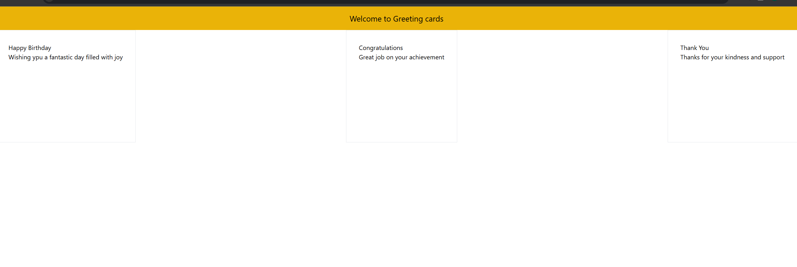

## Greeting Cards Application

Developed a React application called "Greeting Cards" using Vite for fast project scaffolding and Tailwind CSS for streamlined styling. This project focuses on creating reusable and functional components such as Header, GreetingCard, and App, promoting a modular approach to UI design. The application dynamically renders content using props, ensuring flexibility and reusability.

## Key Highlights:
1. Learned to efficiently scaffold React projects using Vite, optimizing development speed.
2. Utilized Tailwind CSS to implement modern and responsive design principles.
3. Created reusable components, emphasizing clean code and modular design patterns.
4. Explored dynamic content rendering with props for flexibility and scalability.
5. Focused on maintaining a visually appealing and user-friendly interface.

## Output for the project
